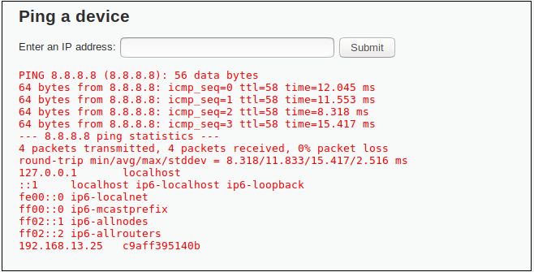
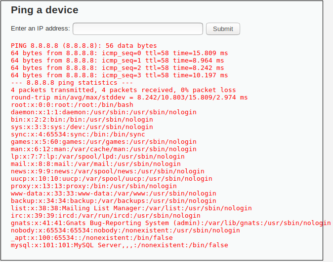
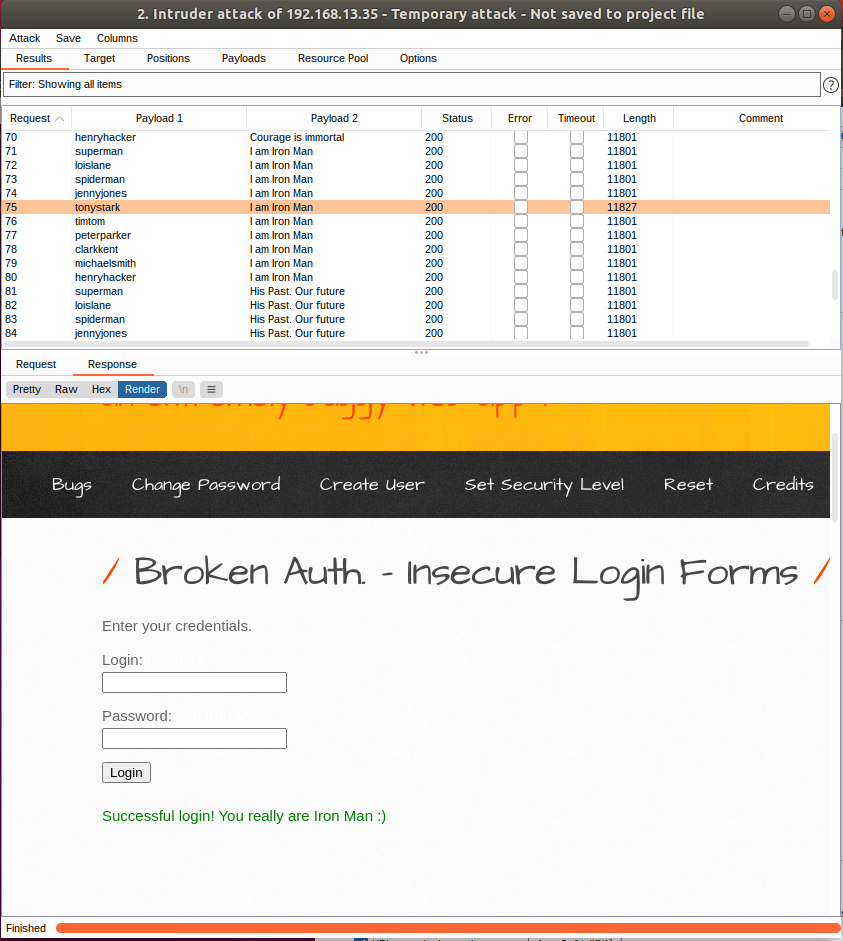
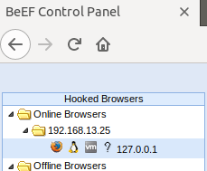
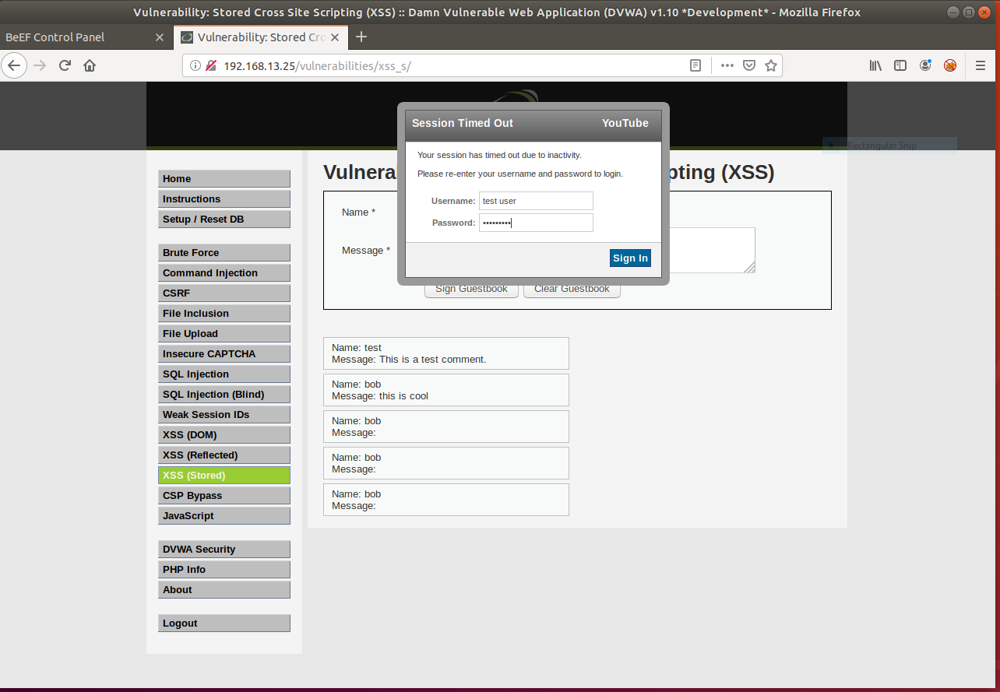
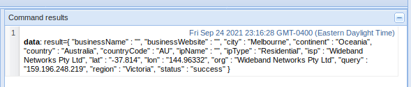
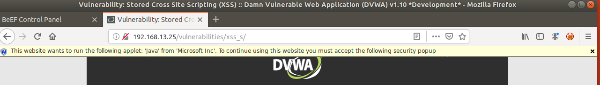

# Web Application 1 :  

 
 

## Mitigations -  
The Main way I would consider to mitigate this particular issue is to implement Input validation which will only allow an ip address lookup and will return an error if any other input is placed into the field.

Another solid way to mitigate this vulnerability is to have the application handling the lookup being run at the lowest possible privilege as to avoid unwanted commands being run against the web server and only allow the application to control and run specific commands.

# Web Application 2 :  

 

## Mitigations -  
A simple and rather effective way to mitigate this particular vulnerability is to implement 2FA (two factor authentication) as this will limit who can actually access this login even if the username and password is compromised.

Another effective way is to have strong passwords set to change regularly automatically, and alongside this I would also implement a lockout system that will prevent more than 5 or so incorrect responses thus closing out the account.

# Web Application 2 :  

  
 
 
 

## Mitigations -  
In this case Mitigation is a more complex situation as it involves multiple steps and relies on effective training for the user themselves. For example a user should be trained to not input any login information in a random pop up that wasn’t the intended outcome to whatever they were doing, but as far as technical mitigations we can implement client side AV or detection software that will halt scripts that try to run. 

You can also implement out of band notification and confirmation that will explain what scripts are running and the outcome of said scripts and requires the user to confirm or deny whether or not they would wish to proceed, i personally would not use this tactic as it will be reliant solely on the users experience and knowledge but it can be used nonetheless.

# References

- Owasp.org. 2021. Blocking Brute Force Attacks Control | OWASP Foundation. [online] Available at: <https://owasp.org/www-community/controls/Blocking_Brute_Force_Attacks>  

- Cynet. 2021. Man-in-the-Browser Attacks. [online] Available at: <https://www.cynet.com/attack-techniques-hands-on/man-in-the-browser-attacks/>  

- Cheatsheetseries.owasp.org. 2021. OS Command Injection Defense - OWASP Cheat Sheet Series. [online] Available at: <https://cheatsheetseries.owasp.org/cheatsheets/OS_Command_Injection_Defense_Cheat_Sheet.html>  

